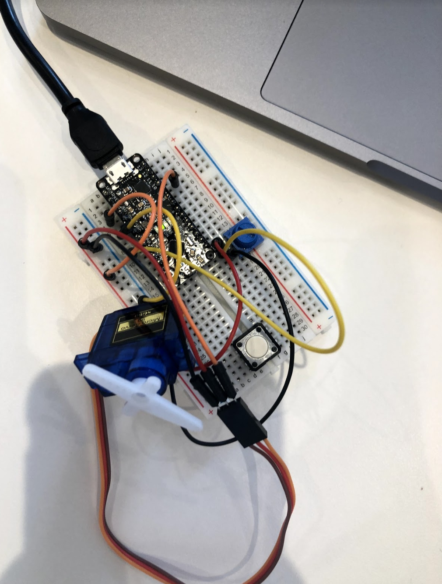

# Paper Puppets

*A lab report by John Q. Student*

## In this Report

To submit your lab, clone [this repository](https://github.com/FAR-Lab/IDD-Fa18-Lab4). You'll need to describe your design, include a video of your paper display in operation, and upload any code you wrote to make it move.

## Part A. Actuating DC motors

**Link to a video of your virbation motor**

## Part B. Actuating Servo motors

### Part 1. Connect the Servo to your breadboard

**a. Which color wires correspond to power, ground and signal?**

Power = Red
Brown = Ground
Orange = Signal

### Part 2. Connect the Servo to your Arduino

**a. Which Arduino pin should the signal line of the servo be attached to?**

Pin 9

**b. What aspects of the Servo code control angle or speed?**

```myservo.write(pos)```

## Part C. Integrating input and output

**Include a photo/movie of your raw circuit in action.**
[Potentiometer controlling Servo Demo](https://drive.google.com/file/d/1bHEnCXqqYbjzoCqx_ZDifpZA8wKYrGNh/view?usp=sharing)


## Part D. Paper puppet

**a. Make a video of your proto puppet.**

## Part E. Make it your own

**a. Make a video of your final design.**
 
